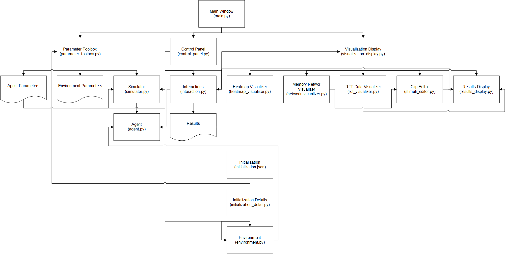
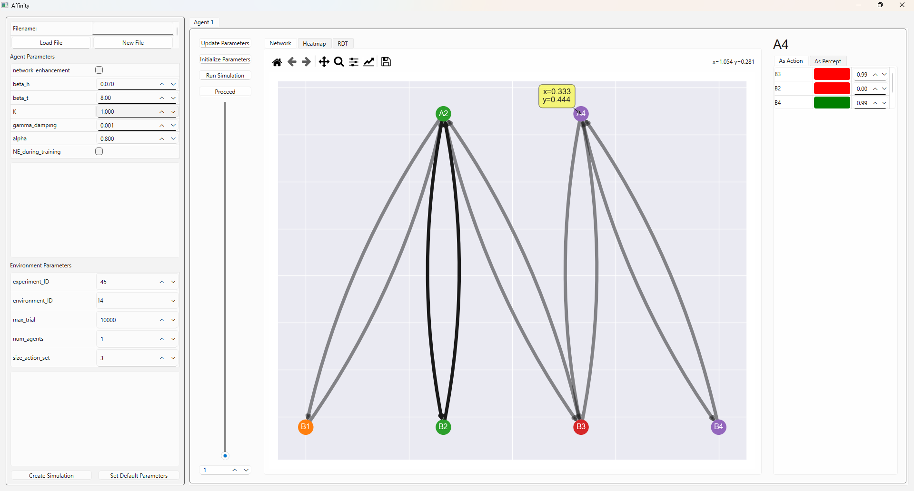
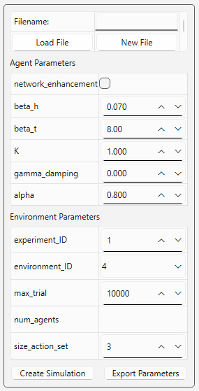
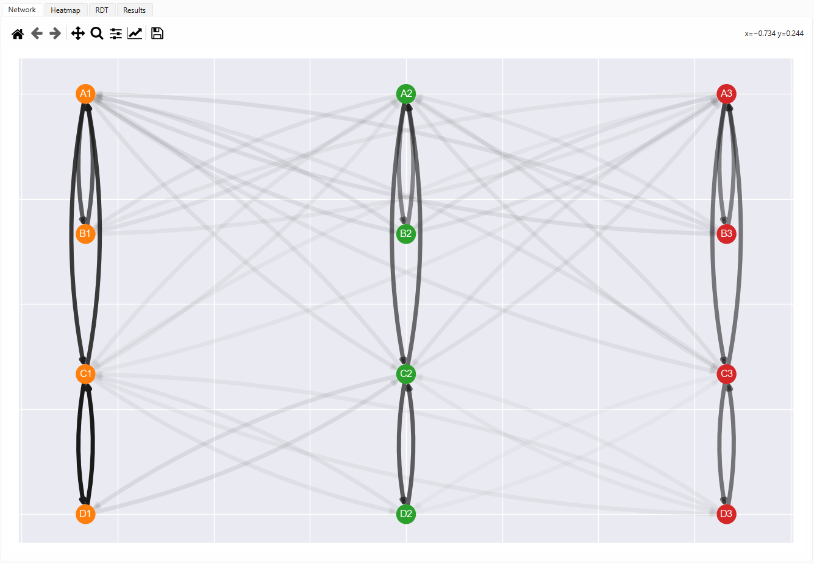
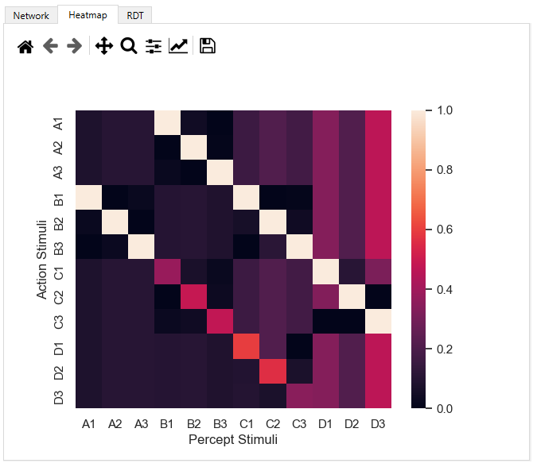
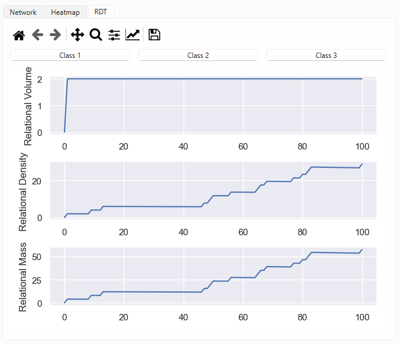

# Affinity: an visualisation tool for Enhanced Equivalence Projective Simulation

The original README can be found here: [EEPS](https://github.com/Asieh-A-Mofrad/Enhanced-Equivalence-Projective-Simulation)

## Motivation and Project Objectives

This project was created as part of a summer project on the foundation year of the Interactive Artificial Intelligence Centre for Doctoral Training at the University of Bristol

With this in mind, the key objectives of this prototype are:

1. To create a tool for visualising the the behavior of agent behavior during the training and testing stages of EEPS, both as a means of exploring simulations of RDT in EEPS and visualising projective simulation.
2. Provide a platform for the realtime manipulation of

The objectives previously achieved in this project are:

1. Gain a deeper understanding of projective simulation and EEPS
2. Explore the simulation of RDT

## Installation

To run Affinity, it is reccomended that you utilise a custom environment via conda. Once done, install the required packages via

```lang-bash
pip install -r requirements.txt
```

### Common Issues

## Walkthrough

This section will provide the step-by-step process for recreating the experiments included in the corresponding paper on Affinity.

1. Install Affinity
2. Launch Affinity by running the `main.py` script
3. Set these agent parameters to the following:
   - $\beta_h$ / `beta_h` = 0.1
   - $\beta_t$ / `beta_t` = 4.0
   - $K$ = 1.0
   - $\gamma$ / `gamma_damping` = 0.001
   - $\alpha$ / `alpha` = 0.7
4. Set these environment parameters to the following:
   - `environment_ID` = 15
   - `max_trial` = 10000
   - `num_agents` = 15
   - `size_action_set` = 4
   - `autogenerate_classes` = [x]

## Structure of Affinity



## Interface Design



Affinity's interface is made up of four components:

1. Parameter Toolbox
2. Visualisation Display
3. Control Panel
4. Relation Editor

These components act as the frontend of the software. `main.py` acts as a intermediary between the GUI of Affinity and the backend, which is handled by `simulator.py`. `visualization_display.py` is a container for Affinity's visualisations and results.

### Parameter Toolbox



The Parameter toolbox is where user can modify agent and environment parameters and load results from previous experiments. Definitions are provided for each parameter, and Affinity utilises a JSON file for saving a deafult set of parameters that are shown each time the software is launched.

### Visualisation Display

The visulisation display is the main components of Affinity, which is comprised of a tab-based interface containing each of the three visualisations, and the results upon the completion of an experiment.

#### Network Visualisation



The **Network** tab on the main display contains visualisations of the agents clip space as a graph network. These visualisations are inspired by figures provided in the original EEPS paper, and provide a dynamic 

#### Heatmap Visualisation



In the **Heatmap** tab, an alternative view of the agent's clip space is provided. This interface is cleaner and less cluttered than the graph network visualisation.

#### Realtional Density Theory Visualisations



Under the **RDT** tab, Affinity provides novel visualisations of metrics provided as part of Belisle and Dixon's Relational Density Theory.

On the top right of the display are two dropdown menus which allow the user to switch between various measures of relational volume and relational mass. Switching between the different measures updates the relational mass figure at the bottom.

##### Relational Volume

|Measure                 |Description|Rationale|
|:-----------------------|:----------|:--------|
|True Nodal Distance     |Total nodal distance between stimuli in a class, where each distance is obtained via the shortest nodal distance between stimuli (including symmetry, transitivity, and equivalence relations)||
|Empirical Nodal Distance|Based on Fields [[2]](#2), total nodal distance in a class, where a stimuli is counted as part of the class if it has two trained relations||
|Class Size              |Total number of stimuli in each class||
|Number of Relations     |Total number of relations between stimuli in a class (including symmetry, transitivity, and equivalence relations)||

##### Relational Density

|Measure                            |Description|Rationale|
|:----------------------------------|:----------|:--------|
|Mean softmax transition probability|||
|Class Accuracy                     |||
|Mean edge weight/h-value           |||

### Stimuli Editor

### Experiment Designer

### Changes to EEPS

To achieve the aims of this project, several changes were made to the original EEPS code. These are outlined below

#### Visualisation Support

#### Network Enhancement During Training

## Future Work

- [ ] Drag and drop tabs
- [ ] Modifying connections via the heatmap visualisation
- [ ] An interface for creating new experiments
- [ ] A system for integrating other EEPS/EPS/PS variants within the visualisation framework of Affinity
- [ ] Various keyboard shortcuts
  
## References

<a id="2">[2]</a>
Cotter, Eoin, and Ian Stewart. "The role of volume in relational density theory: Isolating the effects of class size and nodal distance on density and resistance in equivalence classes." The Psychological Record 73.3 (2023): 375-393.

